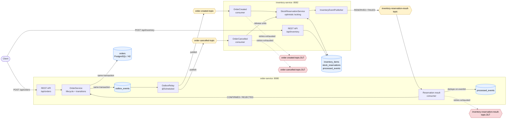
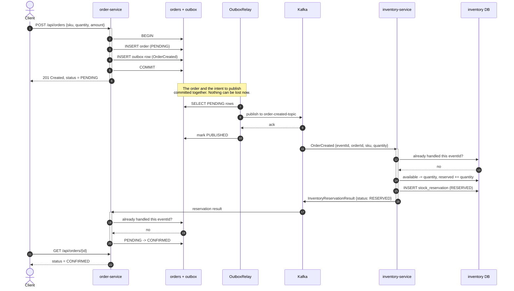
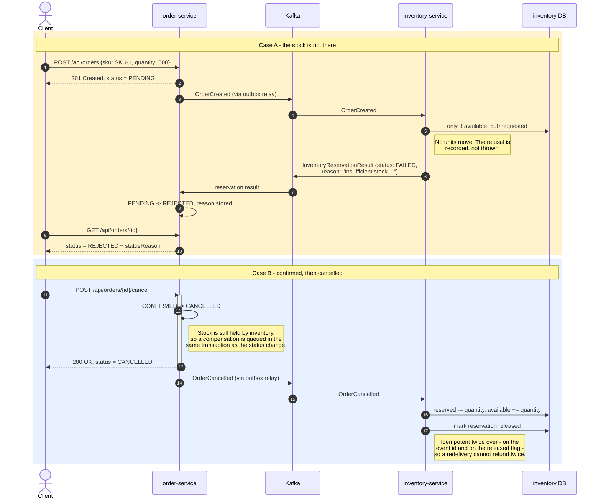
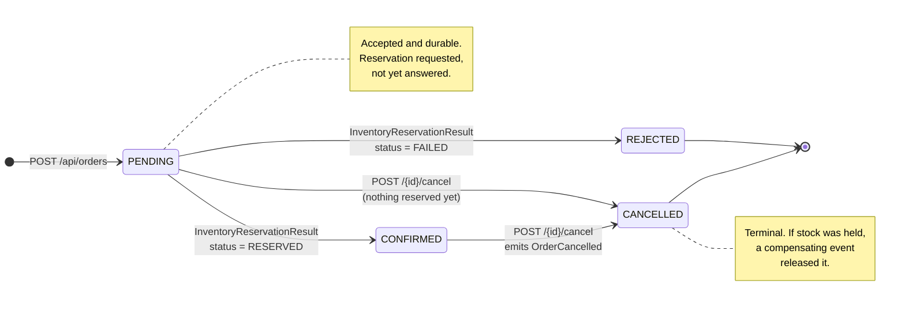

# Event-Driven Order Platform

[](https://github.com/vivekkumarq/event-driven-order-platform/actions/workflows/ci.yml)
[](https://adoptium.net/temurin/releases/?version=17)
[](https://spring.io/projects/spring-boot)
[](https://kafka.apache.org/)
[](LICENSE)

Two Spring Boot microservices that place orders and reserve stock for them by exchanging events over
Kafka. The interesting part is not that they use Kafka — it is what it takes to make an asynchronous
exchange actually correct: a **choreographed saga** with a result event flowing back, a
**transactional outbox** so an order and its event cannot disagree, **idempotent consumption** so a
redelivery cannot reserve stock twice, **optimistic locking** so concurrent consumers cannot oversell
a SKU, and **retries with dead-letter topics** so a poison message cannot block a partition.

Everything documented below exists in the code and runs. Where something is unverified or
deliberately left out, it says so — see [Known limitations](#known-limitations).

---

## Table of contents

- [Why this exists](#why-this-exists)
- [Features](#features)
- [Architecture](#architecture)
- [How an order flows](#how-an-order-flows)
- [Order lifecycle](#order-lifecycle)
- [Tech stack](#tech-stack)
- [Getting started](#getting-started)
- [API reference](#api-reference)
- [Event catalogue](#event-catalogue)
- [End-to-end walkthrough](#end-to-end-walkthrough)
- [Configuration](#configuration)
- [Observability](#observability)
- [Testing](#testing)
- [Project structure](#project-structure)
- [Screenshots](#screenshots)
- [Known limitations](#known-limitations)
- [Roadmap](#roadmap)
- [Contributing](#contributing)
- [License](#license)

---

## Why this exists

Publishing an event and hoping for the best is easy. The problems start immediately afterwards, and
they are the reason this project exists:

| The problem | What happens without a fix | How it is solved here |
| --- | --- | --- |
| **Dual write** | The order is saved, the Kafka publish fails, and the event is lost forever. Nothing retries and nothing notices. | The event is written to an outbox table in the same transaction as the order. A relay publishes it afterwards. |
| **At-least-once delivery** | Kafka redelivers. The same OrderCreated event reserves stock twice and the SKU is silently oversold. | Every event carries an `eventId`. Consumers record it and skip anything they have already handled. |
| **Concurrent consumers** | Two consumers read the same stock row, both write their own view back, the second overwrites the first, and the SKU is oversold with no error anywhere. | An optimistic `@Version` column turns the collision into an exception, which is retried against freshly read state. |
| **Poison messages** | One record that always throws is retried forever and blocks every message behind it on that partition. | Retries with backoff, then the record is parked on `<topic>.DLT`. |
| **No answer** | The order never learns whether its stock exists, so it sits in its initial state forever. | Inventory publishes its decision back, and the order advances to CONFIRMED or REJECTED. |
| **Cancellation** | Stock stays reserved for an order that no longer exists. | A compensating `OrderCancelled` event releases the units. |

---

## Features

### Order lifecycle
- Orders start `PENDING` and move to `CONFIRMED`, `REJECTED` or `CANCELLED`.
- Legal transitions are encoded on the `OrderStatus` enum and enforced by the entity, so an illegal
  transition throws rather than corrupting state.
- Cancellation is allowed from `PENDING` and `CONFIRMED`; `REJECTED` and `CANCELLED` are terminal.
- Rejection and cancellation reasons are stored on the order and returned by the API.

### Saga and messaging
- Choreographed saga: `OrderCreated` → reservation → result event → order status.
- Compensating `OrderCancelled` event releases stock held by a cancelled order.
- The awkward race is handled: if an order is cancelled while its reservation is still in flight, the
  arriving `RESERVED` result triggers the compensation instead of being applied.
- Transactional outbox with a scheduled relay, attempt counting and a parked `FAILED` state.
- Idempotent consumption on `eventId` in both services.
- Consumer retry with fixed backoff plus a dead-letter topic per source topic. Unretryable failures
  (a malformed payload) skip the backoff and go straight to the DLT.
- Producers use `acks=all` with idempotence enabled.

### Inventory
- Stock modelled as two buckets — available and reserved — whose sum is the physical stock. Every
  operation conserves it.
- Optimistic locking with a retry loop that sits outside the transaction, where a commit-time
  conflict can actually be caught.
- Insufficient stock and unknown SKU are refused with a reason rather than throwing.
- REST CRUD for stock levels.

### Platform
- Bean Validation on every request DTO; RFC 7807 problem responses for failures.
- OpenAPI 3 with Swagger UI in both services.
- Actuator with a Prometheus endpoint and custom business metrics.
- H2 for dev and test, PostgreSQL behind a `prod` profile.
- Multi-stage Dockerfiles, a compose stack with Kafka in KRaft mode, and GitHub Actions CI.

---

## Architecture



The two services share no code and no database. They keep their own copies of the event records and
deserialise by explicit type rather than by Kafka type headers, so the contract between them is the
JSON on the wire and either can be deployed without the other.

---

## How an order flows

### Happy path — stock is available



### Compensation path — insufficient stock, then a cancellation



---

## Order lifecycle



Transitions not drawn above are rejected: the enum returns `false` from `canTransitionTo`, the entity
throws, and the API answers `409 Conflict`.

---

## Tech stack

| Layer | Technology | Version |
| --- | --- | --- |
| Language | Java | 17 |
| Framework | Spring Boot | 3.5.10 |
| Core | Spring Framework | 6.2.15 |
| Messaging | Spring for Apache Kafka | 3.3.12 |
| Messaging | Apache Kafka clients | 3.9.1 |
| Broker | Apache Kafka (KRaft, no ZooKeeper) | 3.9.1 |
| Persistence | Spring Data JPA / Hibernate ORM | 6.6.41.Final |
| Database (dev, test) | H2 | 2.3.232 |
| Database (prod profile) | PostgreSQL driver | 42.7.9 |
| API docs | springdoc-openapi | 2.8.13 |
| Metrics | Micrometer + Prometheus registry | 1.15.8 |
| JSON | Jackson | 2.19.4 |
| Testing | JUnit 5, Mockito, AssertJ, Awaitility, spring-kafka-test | via Boot BOM |
| Build | Maven (wrapper) | 3.9.12 |
| CI | GitHub Actions | — |

---

## Getting started

### Prerequisites

- **JDK 17** — the only hard requirement. Maven comes from the wrapper.
- **Docker + Docker Compose** — optional, only for running the whole stack together.

You do **not** need a Kafka broker or a database to build and test: the databases are in-memory H2
and the integration tests start Kafka in-process with `@EmbeddedKafka`.

### 1. Build and test

Each service is a standalone Maven project, built from its own directory:

```bash
cd order-service     && ./mvnw -B clean verify && cd ..
cd inventory-service && ./mvnw -B clean verify && cd ..
```

Use `mvnw.cmd` instead of `./mvnw` on Windows. There is also a root aggregator POM, so
`./mvnw -B clean verify` from the repository root builds both modules in one go.

### 2. Start the infrastructure

```bash
cp .env.example .env
docker compose up -d kafka postgres
docker compose ps
```

The broker is reachable at `localhost:29092` from your machine and at `kafka:9092` from inside the
compose network. Both are advertised, which is what lets the services work either way.

Add Kafka UI on `http://localhost:8090` if you want to watch the topics:

```bash
docker compose --profile tools up -d kafka-ui
```

### 3. Run the services

**Option A — from source, against H2 (no database container needed).** Two terminals:

```bash
cd order-service
./mvnw spring-boot:run -Dspring-boot.run.arguments=--spring.kafka.bootstrap-servers=localhost:29092
```

```bash
cd inventory-service
./mvnw spring-boot:run -Dspring-boot.run.arguments=--spring.kafka.bootstrap-servers=localhost:29092
```

If you started the broker some other way and it listens on `localhost:9092`, drop the argument — that
is the default.

**Option B — everything in containers, against PostgreSQL:**

```bash
docker compose up -d --build
```

This runs both services with `SPRING_PROFILES_ACTIVE=prod`, pointing at PostgreSQL and at
`kafka:9092`, and waits for the broker and database healthchecks before starting them.

### 4. Check it is up

| | order-service | inventory-service |
| --- | --- | --- |
| Base URL | http://localhost:8080 | http://localhost:8082 |
| Swagger UI | http://localhost:8080/swagger-ui.html | http://localhost:8082/swagger-ui.html |
| OpenAPI JSON | http://localhost:8080/v3/api-docs | http://localhost:8082/v3/api-docs |
| Health | http://localhost:8080/actuator/health | http://localhost:8082/actuator/health |
| Prometheus | http://localhost:8080/actuator/prometheus | http://localhost:8082/actuator/prometheus |
| H2 console (dev only) | http://localhost:8080/h2-console | http://localhost:8082/h2-console |

A Postman collection covering every endpoint is at
[`docs/postman/event-driven-order-management.postman_collection.json`](docs/postman/event-driven-order-management.postman_collection.json).

---

## API reference

### order-service — `http://localhost:8080`

| Method | Path | Description | Success | Errors |
| --- | --- | --- | --- | --- |
| `POST` | `/api/orders` | Place an order. Stores it as `PENDING` and queues an `OrderCreated` event. | `201 Created` + `Location` | `400` validation |
| `GET` | `/api/orders/{id}` | Fetch one order. | `200 OK` | `404` unknown id |
| `GET` | `/api/orders` | List orders, newest first. Optional `?status=` filter. | `200 OK` | — |
| `POST` | `/api/orders/{id}/cancel` | Cancel an order. Optional `?reason=`. | `200 OK` | `404` unknown id, `409` already terminal |

<details>
<summary><b>POST /api/orders</b></summary>

Request:

```json
{
  "sku": "SKU-LAPTOP-01",
  "quantity": 2,
  "amount": 1499.99
}
```

| Field | Rules |
| --- | --- |
| `sku` | required, non-blank, max 64 characters |
| `quantity` | required, 1 to 1000 |
| `amount` | required, > 0, at most 2 decimal places |

`201 Created`, `Location: http://localhost:8080/api/orders/{id}`:

```json
{
  "id": "3f2a1c9e-8b4d-4f1a-9c2e-7d5b6a0f1e33",
  "sku": "SKU-LAPTOP-01",
  "quantity": 2,
  "amount": 1499.99,
  "status": "PENDING",
  "statusReason": null,
  "createdAt": "2026-08-29T09:14:22.481Z",
  "updatedAt": "2026-08-29T09:14:22.481Z"
}
```

`400 Bad Request` (RFC 7807):

```json
{
  "type": "about:blank",
  "title": "Invalid request",
  "status": 400,
  "detail": "Request validation failed",
  "instance": "/api/orders",
  "errors": {
    "sku": "must not be blank",
    "quantity": "must be greater than or equal to 1",
    "amount": "amount must be greater than zero"
  }
}
```

</details>

<details>
<summary><b>GET /api/orders/{id}</b></summary>

`200 OK` once inventory has answered:

```json
{
  "id": "3f2a1c9e-8b4d-4f1a-9c2e-7d5b6a0f1e33",
  "sku": "SKU-LAPTOP-01",
  "quantity": 2,
  "amount": 1499.99,
  "status": "CONFIRMED",
  "statusReason": null,
  "createdAt": "2026-08-29T09:14:22.481Z",
  "updatedAt": "2026-08-29T09:14:23.107Z"
}
```

A rejected order carries the reason inventory gave:

```json
{
  "status": "REJECTED",
  "statusReason": "Insufficient stock for SKU SKU-LAPTOP-01: requested 500, available 3"
}
```

`404 Not Found`:

```json
{
  "type": "about:blank",
  "title": "Order not found",
  "status": 404,
  "detail": "Order not found: 3f2a1c9e-8b4d-4f1a-9c2e-7d5b6a0f1e33"
}
```

</details>

<details>
<summary><b>GET /api/orders?status=CONFIRMED</b></summary>

`status` is one of `PENDING`, `CONFIRMED`, `REJECTED`, `CANCELLED`. Omit it for everything.

```json
[
  {
    "id": "3f2a1c9e-8b4d-4f1a-9c2e-7d5b6a0f1e33",
    "sku": "SKU-LAPTOP-01",
    "quantity": 2,
    "amount": 1499.99,
    "status": "CONFIRMED",
    "statusReason": null,
    "createdAt": "2026-08-29T09:14:22.481Z",
    "updatedAt": "2026-08-29T09:14:23.107Z"
  }
]
```

</details>

<details>
<summary><b>POST /api/orders/{id}/cancel?reason=...</b></summary>

`200 OK`:

```json
{
  "id": "3f2a1c9e-8b4d-4f1a-9c2e-7d5b6a0f1e33",
  "sku": "SKU-LAPTOP-01",
  "quantity": 2,
  "amount": 1499.99,
  "status": "CANCELLED",
  "statusReason": "customer changed their mind",
  "createdAt": "2026-08-29T09:14:22.481Z",
  "updatedAt": "2026-08-29T09:18:03.660Z"
}
```

Cancelling a `CONFIRMED` order also queues an `OrderCancelled` event that releases the stock.
Cancelling an order that is already `REJECTED` or `CANCELLED` gives `409 Conflict`:

```json
{
  "type": "about:blank",
  "title": "Illegal order state transition",
  "status": 409,
  "detail": "Illegal order status transition: REJECTED -> CANCELLED"
}
```

</details>

### inventory-service — `http://localhost:8082`

| Method | Path | Description | Success | Errors |
| --- | --- | --- | --- | --- |
| `POST` | `/api/inventory` | Create a SKU with an opening stock level. | `201 Created` + `Location` | `400` validation, `409` duplicate SKU |
| `GET` | `/api/inventory` | List every SKU, ordered by SKU. | `200 OK` | — |
| `GET` | `/api/inventory/{sku}` | Stock position for one SKU. | `200 OK` | `404` unknown SKU |
| `PUT` | `/api/inventory/{sku}` | Replace the sellable stock level. | `200 OK` | `400` validation, `404` unknown SKU |
| `DELETE` | `/api/inventory/{sku}` | Delete a SKU. | `204 No Content` | `404` unknown SKU |

<details>
<summary><b>POST /api/inventory</b></summary>

Request:

```json
{
  "sku": "SKU-LAPTOP-01",
  "availableQuantity": 100
}
```

`201 Created`, `Location: http://localhost:8082/api/inventory/SKU-LAPTOP-01`:

```json
{
  "id": "b1d2c3e4-5f60-4718-9a2b-3c4d5e6f7081",
  "sku": "SKU-LAPTOP-01",
  "availableQuantity": 100,
  "reservedQuantity": 0,
  "totalQuantity": 100,
  "version": 0,
  "createdAt": "2026-08-29T09:13:58.012Z",
  "updatedAt": "2026-08-29T09:13:58.012Z"
}
```

`409 Conflict` when the SKU already exists:

```json
{
  "type": "about:blank",
  "title": "Duplicate SKU",
  "status": 409,
  "detail": "Inventory item already exists for SKU: SKU-LAPTOP-01"
}
```

</details>

<details>
<summary><b>GET /api/inventory/{sku}</b></summary>

After two units have been reserved by an order:

```json
{
  "id": "b1d2c3e4-5f60-4718-9a2b-3c4d5e6f7081",
  "sku": "SKU-LAPTOP-01",
  "availableQuantity": 98,
  "reservedQuantity": 2,
  "totalQuantity": 100,
  "version": 1,
  "createdAt": "2026-08-29T09:13:58.012Z",
  "updatedAt": "2026-08-29T09:14:23.044Z"
}
```

`availableQuantity` can be sold; `reservedQuantity` is committed to orders that have not shipped.
`totalQuantity` is their sum and is conserved by every reserve and release. `version` is the
optimistic locking counter — it increments on every reservation.

</details>

<details>
<summary><b>PUT /api/inventory/{sku}</b></summary>

Request:

```json
{
  "availableQuantity": 250
}
```

Sets the sellable quantity. Reserved units are **not** touched, so the response after the example
above would be `availableQuantity: 250, reservedQuantity: 2, totalQuantity: 252`.

</details>

---

## Event catalogue

All three topics carry JSON with a `String` key. **The key is always the order id**, so everything
about one order lands on one partition and stays in order.

Every event carries an `eventId`, which is the de-duplication key. Consumers record handled ids and
skip repeats — Kafka delivers at least once, and this is what makes that safe.

### `order-created-topic`

| | |
| --- | --- |
| **Producer** | order-service, via the transactional outbox relay |
| **Consumer** | inventory-service (`inventory-service-group`) |
| **Key** | order id |
| **Purpose** | Ask inventory to reserve stock for a new order |
| **Retry policy** | 3 redeliveries, 1000 ms fixed backoff |
| **Dead letter** | `order-created-topic.DLT` |

```json
{
  "eventId": "0a1b2c3d-4e5f-4061-8273-8495a6b7c8d9",
  "orderId": "3f2a1c9e-8b4d-4f1a-9c2e-7d5b6a0f1e33",
  "sku": "SKU-LAPTOP-01",
  "quantity": 2,
  "amount": 1499.99,
  "occurredAt": "2026-08-29T09:14:22.481Z"
}
```

### `inventory-reservation-result-topic`

| | |
| --- | --- |
| **Producer** | inventory-service |
| **Consumer** | order-service (`order-service-group`) |
| **Key** | order id |
| **Purpose** | Report the reservation outcome so the order can leave `PENDING` |
| **Retry policy** | 3 redeliveries, 1000 ms fixed backoff |
| **Dead letter** | `inventory-reservation-result-topic.DLT` |

One topic carries both outcomes, discriminated by `status`. `RESERVED` is the *InventoryReserved*
case; `FAILED` is *InventoryReservationFailed*, with `reason` filled in. Keeping both on one topic
keeps a single ordering and a single consumer group for what is really one decision.

```json
{
  "eventId": "9f8e7d6c-5b4a-4392-8170-6f5e4d3c2b1a",
  "orderId": "3f2a1c9e-8b4d-4f1a-9c2e-7d5b6a0f1e33",
  "sku": "SKU-LAPTOP-01",
  "quantity": 2,
  "status": "RESERVED",
  "reason": null,
  "occurredAt": "2026-08-29T09:14:23.044Z"
}
```

Failure variant:

```json
{
  "eventId": "1c2d3e4f-5061-4728-9384-a5b6c7d8e9f0",
  "orderId": "7b8c9d0e-1f2a-4b3c-8d4e-5f60718293a4",
  "sku": "SKU-LAPTOP-01",
  "quantity": 500,
  "status": "FAILED",
  "reason": "Insufficient stock for SKU SKU-LAPTOP-01: requested 500, available 3",
  "occurredAt": "2026-08-29T09:20:11.905Z"
}
```

`status` is `RESERVED` or `FAILED`. Failure reasons currently produced: `Unknown SKU: {sku}` and
`Insufficient stock for SKU {sku}: requested {n}, available {m}`.

### `order-cancelled-topic`

| | |
| --- | --- |
| **Producer** | order-service, via the transactional outbox relay |
| **Consumer** | inventory-service (`inventory-service-group`) |
| **Key** | order id |
| **Purpose** | Compensating event — release stock held for a cancelled order |
| **Retry policy** | 3 redeliveries, 1000 ms fixed backoff |
| **Dead letter** | `order-cancelled-topic.DLT` |

Emitted when a `CONFIRMED` order is cancelled, and also when a `RESERVED` result arrives for an order
that was cancelled while the reservation was in flight.

```json
{
  "eventId": "4d5e6f70-8192-4a3b-8c4d-5e6f708192a3",
  "orderId": "3f2a1c9e-8b4d-4f1a-9c2e-7d5b6a0f1e33",
  "sku": "SKU-LAPTOP-01",
  "quantity": 2,
  "reason": "customer changed their mind",
  "occurredAt": "2026-08-29T09:18:03.660Z"
}
```

### Dead-letter topics

Each source topic has a `.DLT` counterpart. A record reaches it when the handler has failed every
retry, or immediately if the failure can never succeed on a retry — a payload that will not
deserialise, most obviously. Nothing consumes the DLTs; they are there for an operator to inspect and
replay. Every message parked there increments the `platform_kafka_dlt_messages_total` counter, tagged
with the source topic.

---

## End-to-end walkthrough

With the broker up and both services running, this takes an order all the way through.

**1. Stock the SKU.**

```bash
curl -s -X POST http://localhost:8082/api/inventory \
  -H 'Content-Type: application/json' \
  -d '{"sku":"SKU-LAPTOP-01","availableQuantity":100}'
```

```json
{"sku":"SKU-LAPTOP-01","availableQuantity":100,"reservedQuantity":0,"totalQuantity":100,"version":0}
```

**2. Place an order.**

```bash
ORDER_ID=$(curl -s -X POST http://localhost:8080/api/orders \
  -H 'Content-Type: application/json' \
  -d '{"sku":"SKU-LAPTOP-01","quantity":2,"amount":1499.99}' \
  | sed -E 's/.*"id":"([^"]+)".*/\1/')
echo "$ORDER_ID"
```

The response comes back immediately with `"status":"PENDING"`. Nothing has been reserved yet — the
event is sitting in the outbox, committed alongside the order.

**3. Watch it become CONFIRMED.** The relay polls once a second, so give it a moment:

```bash
sleep 2
curl -s "http://localhost:8080/api/orders/$ORDER_ID"
```

```json
{"id":"...","sku":"SKU-LAPTOP-01","quantity":2,"amount":1499.99,"status":"CONFIRMED","statusReason":null}
```

**4. Confirm the stock actually moved.**

```bash
curl -s http://localhost:8082/api/inventory/SKU-LAPTOP-01
```

```json
{"sku":"SKU-LAPTOP-01","availableQuantity":98,"reservedQuantity":2,"totalQuantity":100,"version":1}
```

Two units moved from available to reserved. The total is unchanged, and `version` has incremented.

**5. Try to over-order and watch it be rejected.**

```bash
REJECTED_ID=$(curl -s -X POST http://localhost:8080/api/orders \
  -H 'Content-Type: application/json' \
  -d '{"sku":"SKU-LAPTOP-01","quantity":500,"amount":99999.00}' \
  | sed -E 's/.*"id":"([^"]+)".*/\1/')
sleep 2
curl -s "http://localhost:8080/api/orders/$REJECTED_ID"
```

```json
{"status":"REJECTED","statusReason":"Insufficient stock for SKU SKU-LAPTOP-01: requested 500, available 98"}
```

No units moved: `availableQuantity` is still 98.

**6. Cancel the confirmed order and watch the compensation.**

```bash
curl -s -X POST "http://localhost:8080/api/orders/$ORDER_ID/cancel?reason=changed+my+mind"
sleep 2
curl -s http://localhost:8082/api/inventory/SKU-LAPTOP-01
```

```json
{"sku":"SKU-LAPTOP-01","availableQuantity":100,"reservedQuantity":0,"totalQuantity":100,"version":2}
```

The two units are back. The order is `CANCELLED`, and the release happened because order-service
published a compensating `OrderCancelled` event, not because anything called inventory directly.

**7. Watch the events go by** (requires the compose broker):

```bash
docker exec -it edop-kafka /opt/kafka/bin/kafka-console-consumer.sh \
  --bootstrap-server localhost:9092 \
  --topic inventory-reservation-result-topic \
  --from-beginning
```

**8. Check the metrics.**

```bash
curl -s http://localhost:8080/actuator/prometheus | grep platform_
curl -s http://localhost:8082/actuator/prometheus | grep platform_
```

---

## Configuration

Every setting is an environment variable with a default, so nothing has to be set to run locally.
[`.env.example`](.env.example) is the full list; the table below is the same set with defaults.

### Both services

| Variable | Default | Description |
| --- | --- | --- |
| `SERVER_PORT` | `8080` / `8082` | HTTP port |
| `SPRING_PROFILES_ACTIVE` | *(none)* | Set to `prod` for PostgreSQL |
| `DATASOURCE_URL` | H2 in-memory | JDBC URL |
| `DATASOURCE_USERNAME` | `sa` | Database user |
| `DATASOURCE_PASSWORD` | *(empty)* | Database password |
| `KAFKA_BOOTSTRAP_SERVERS` | `localhost:9092` | Broker address |
| `KAFKA_CONSUMER_GROUP` | `order-service-group` / `inventory-service-group` | Consumer group id |
| `KAFKA_RETRY_MAX_ATTEMPTS` | `3` | Redeliveries after the first failure, then the DLT |
| `KAFKA_RETRY_BACKOFF_MS` | `1000` | Fixed delay between those attempts |
| `TOPIC_ORDER_CREATED` | `order-created-topic` | Topic name |
| `TOPIC_ORDER_CANCELLED` | `order-cancelled-topic` | Topic name |
| `TOPIC_INVENTORY_RESERVATION_RESULT` | `inventory-reservation-result-topic` | Topic name |
| `LOG_LEVEL` | `INFO` | Log level for the application packages |

### order-service only

| Variable | Default | Description |
| --- | --- | --- |
| `OUTBOX_ENABLED` | `true` | Whether the scheduled relay runs |
| `OUTBOX_POLL_INTERVAL_MS` | `1000` | Delay between relay runs |
| `OUTBOX_BATCH_SIZE` | `50` | Maximum rows published per run |
| `OUTBOX_MAX_ATTEMPTS` | `10` | Publish attempts before a row is parked as `FAILED` |

### inventory-service only

| Variable | Default | Description |
| --- | --- | --- |
| `RESERVATION_MAX_ATTEMPTS` | `5` | Attempts, including the first, before a concurrency conflict is given up on |
| `RESERVATION_BACKOFF_MS` | `25` | Base delay between attempts; grows linearly with the attempt number |

### docker compose only

| Variable | Default | Description |
| --- | --- | --- |
| `KAFKA_HOST_PORT` | `29092` | Host port that reaches the broker |
| `KAFKA_CLUSTER_ID` | `5L6g3nShT-eMCtK--X86sw` | KRaft cluster id, used on first start |
| `POSTGRES_HOST_PORT` | `5432` | Host port for PostgreSQL |
| `POSTGRES_USER` | `platform` | PostgreSQL user |
| `POSTGRES_PASSWORD` | `platform` | PostgreSQL password |
| `ORDER_SERVICE_PORT` | `8080` | Host port for order-service |
| `INVENTORY_SERVICE_PORT` | `8082` | Host port for inventory-service |
| `KAFKA_UI_PORT` | `8090` | Host port for Kafka UI |

---

## Observability

Both services expose `health`, `info`, `metrics` and `prometheus` on `/actuator`, tagged with
`application`. Alongside the JVM, HTTP and Kafka client metrics Micrometer collects automatically,
these are registered by the application:

| Metric | Service | Type | Meaning |
| --- | --- | --- | --- |
| `platform.orders.created` | order | counter | Orders accepted by the API |
| `platform.orders.confirmed` | order | counter | Orders confirmed after a successful reservation |
| `platform.orders.rejected` | order | counter | Orders rejected because stock could not be reserved |
| `platform.orders.cancelled` | order | counter | Orders cancelled by a caller |
| `platform.outbox.published` | order | counter | Outbox rows relayed to Kafka |
| `platform.outbox.publish.failures` | order | counter | Failed outbox publish attempts |
| `platform.outbox.pending` | order | gauge | Outbox rows waiting to be relayed |
| `platform.inventory.reservations.succeeded` | inventory | counter | Reservations that held the requested units |
| `platform.inventory.reservations.failed` | inventory | counter | Reservations refused |
| `platform.inventory.reservations.released` | inventory | counter | Reservations released by a compensation |
| `platform.inventory.optimistic.lock.retries` | inventory | counter | Attempts retried after a concurrency conflict |
| `platform.events.duplicates.skipped` | both | counter | Redelivered events skipped by de-duplication |
| `platform.kafka.dlt.messages` | both | counter | Records parked on a dead-letter topic, tagged by `topic` |

Prometheus renders these with underscores and a `_total` suffix on counters, e.g.
`platform_orders_confirmed_total`.

**The one to alert on is `platform_outbox_pending`.** A backlog that grows rather than drains means
events are committed to the database but not reaching Kafka, which is precisely the failure the
outbox is designed to make visible instead of silent.

---

## Testing

```bash
cd order-service     && ./mvnw -B clean verify
cd inventory-service && ./mvnw -B clean verify
```

Nothing external is needed. The databases are in-memory H2 under a `test` profile, and the Kafka
integration tests start a real broker in-process with `@EmbeddedKafka` in KRaft mode.

| Test | What it proves |
| --- | --- |
| `OrderStatusTest` | Every legal and illegal transition, parameterised, plus that the entity enforces them |
| `OrderServiceTest` | Create, cancel from each status, the reservation-result paths, de-duplication, and the cancelled-then-reserved compensation |
| `OrderControllerTest` | MockMvc: 201 with `Location`, validation rejections, 404 and 409 problem responses |
| `OutboxServiceTest` | The event is stored as pending JSON, and appending outside a transaction is refused |
| `OutboxRelayTest` | Batch size, oldest-first ordering, retry after a failed publish, parking after exhausted attempts |
| `OrderSagaIntegrationTest` | `@EmbeddedKafka`: an order reaching the topic through the relay, results confirming and rejecting it, a redelivered result being ignored, and cancellation emitting compensation |
| `InventoryItemEntityTest` | The stock invariants, including that a duplicate release cannot drive reserved negative |
| `InventoryServiceTest` | Stock CRUD, duplicate SKU, and that a stock update leaves reservations alone |
| `InventoryControllerTest` | MockMvc: the full CRUD surface and its error responses |
| `StockReservationServiceTest` | Reserve, insufficient stock, unknown SKU, release, and idempotency on both |
| `ConcurrentReservationTest` | Real threads: 20 concurrent orders for the last 5 units produce exactly 5 reservations and 15 refusals; one event delivered 10 times concurrently reserves once |
| `ReservationSagaIntegrationTest` | `@EmbeddedKafka`: consuming `OrderCreated`, publishing `RESERVED` and `FAILED`, redelivery reserving once, and cancellation releasing units |

The saga is covered from both ends rather than in one process: `OrderSagaIntegrationTest` exercises
order-service's two hops and `ReservationSagaIntegrationTest` exercises inventory-service's, against
the same topics and the same JSON contract. Running both services inside one JVM to assert the loop
in a single test would prove less about the wire contract than testing each side against it does.

---

## Project structure

```
event-driven-order-platform/
├── pom.xml                          aggregator; each module is standalone
├── docker-compose.yml               Kafka (KRaft), PostgreSQL, both services, Kafka UI
├── .env.example                     every environment variable, documented
├── docker/postgres/init.sql         creates the second database
├── .github/workflows/ci.yml         matrix build over the two modules
├── docs/
│   ├── postman/                     collection covering every endpoint
│   └── screenshots/
│
├── order-service/
│   ├── Dockerfile                   multi-stage, non-root, healthcheck
│   └── src/main/java/com/vivek/platform/order/
│       ├── api/                     controller, DTOs, RFC 7807 exception handler
│       ├── config/                  Kafka producer/consumer, topics, retry, outbox, OpenAPI
│       ├── domain/                  OrderEntity, OrderStatus, OutboxEventEntity, ProcessedEventEntity
│       ├── events/                  OrderCreated, OrderCancelled, InventoryReservationResult
│       ├── exception/               OrderNotFound, IllegalOrderTransition
│       ├── messaging/               OutboxRelay, reservation-result consumer
│       ├── repository/              orders, outbox, processed events
│       └── service/                 OrderService, OutboxService, OrderMetrics
│
└── inventory-service/
    ├── Dockerfile
    └── src/main/java/com/vivek/platform/inventory/
        ├── api/                     controller, DTOs, RFC 7807 exception handler
        ├── config/                  Kafka producer/consumer, topics, retry, reservation, OpenAPI
        ├── domain/                  InventoryItemEntity, StockReservationEntity, ProcessedEventEntity
        ├── events/                  the same three records, owned independently
        ├── exception/               InventoryItemNotFound, DuplicateSku
        ├── messaging/               OrderCreated and OrderCancelled consumers, result publisher
        ├── repository/              items, reservations, processed events
        └── service/                 InventoryService, StockReservationService,
                                     ReservationCoordinator, InventoryMetrics
```

---

## Screenshots

Placeholders — drop the images into `docs/screenshots/` and they will render here.

| | |
| --- | --- |
| **Swagger UI — order-service** <br/> `docs/screenshots/swagger-order-service.png` | **Swagger UI — inventory-service** <br/> `docs/screenshots/swagger-inventory-service.png` |
| **Kafka UI — topics and DLTs** <br/> `docs/screenshots/kafka-ui-topics.png` | **Prometheus metrics** <br/> `docs/screenshots/actuator-prometheus.png` |
| **An order flowing to CONFIRMED** <br/> `docs/screenshots/order-lifecycle.png` | **Stock moving from available to reserved** <br/> `docs/screenshots/inventory-reservation.png` |

---

## Known limitations

Stated plainly, because a design with no trade-offs is a design nobody has thought about.

- **Docker and the compose stack are unverified.** Docker was not available in the environment this
  revamp was carried out in, so the Dockerfiles and `docker-compose.yml` have been written and
  reviewed but never built or run. Everything else here — the build, the tests, the embedded-broker
  integration tests — was executed.
- **The outbox relay is safe for one instance, not many.** Rows are claimed without a database lock.
  Spring's default scheduler is single-threaded and `fixedDelay` prevents overlapping runs, so a
  single instance cannot double-publish. Running several replicas would need
  `SELECT ... FOR UPDATE SKIP LOCKED`. This is documented on `OutboxRelay` itself.
- **No database migrations.** Hibernate generates the schema with `ddl-auto: update`, in the `prod`
  profile too. Flyway is the obvious next step and is on the roadmap; until then the profile does not
  pretend to use `validate`.
- **Cancelling a `PENDING` order does not pre-emptively release anything**, because nothing is
  reserved yet. If the reservation was in flight, the arriving `RESERVED` result finds a `CANCELLED`
  order and emits the compensation then. Correct, but the units are held for the width of that
  window.
- **Reservation results are published after the transaction commits.** If the process dies in that
  gap, the units are reserved but nobody has been told. The redelivered `OrderCreated` event
  re-publishes the stored decision with its original event id, so it recovers rather than being lost
   — but the order stays `PENDING` until that redelivery happens.
- **No authentication or authorisation.** Every endpoint is open. This is a demonstration of an
  event-driven design, not a hardened service.
- **The stock API is deliberately thin.** It has enough CRUD to drive and inspect the saga; it is not
  a warehouse management system.

---

## Roadmap

- [ ] Flyway migrations, replacing `ddl-auto` in the `prod` profile
- [ ] `SELECT ... FOR UPDATE SKIP LOCKED` in the outbox relay, so it scales past one instance
- [ ] An admin endpoint to inspect and replay dead-letter topics
- [ ] Distributed tracing with Micrometer Tracing and OpenTelemetry, correlating an order across both services
- [ ] A Grafana dashboard shipped alongside the Prometheus endpoints
- [ ] A payment service, making the saga three participants long
- [ ] Schema registry with Avro or Protobuf, replacing hand-rolled JSON contracts
- [ ] OAuth2 resource server on both APIs
- [ ] Kubernetes manifests and a Helm chart

---

## Contributing

See [CONTRIBUTING.md](CONTRIBUTING.md). The short version: JDK 17 is all you need,
`./mvnw -B clean verify` must pass in both modules without skipping tests, and the README documents
only what actually works.

---

## License

[MIT](LICENSE) © 2026 Vivek Kumar
